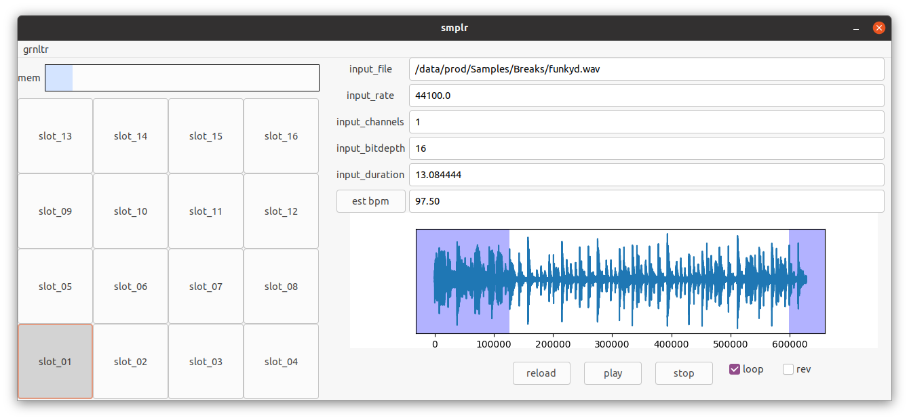
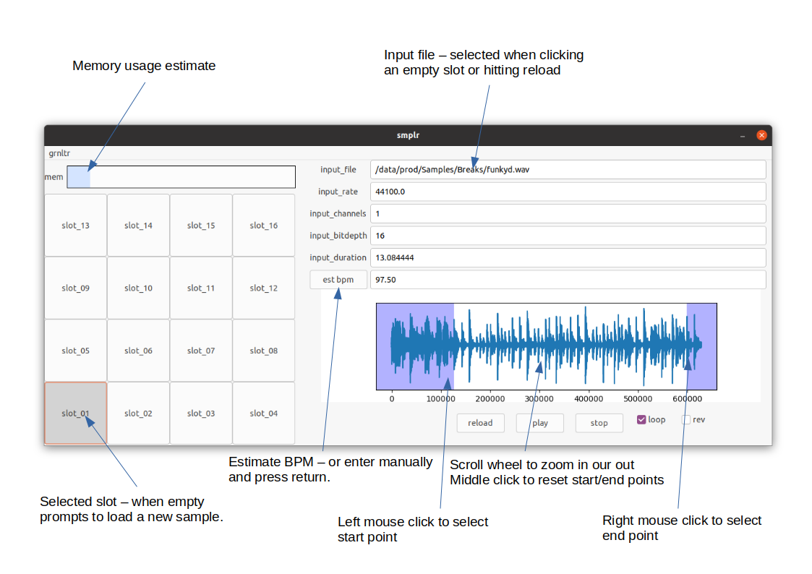
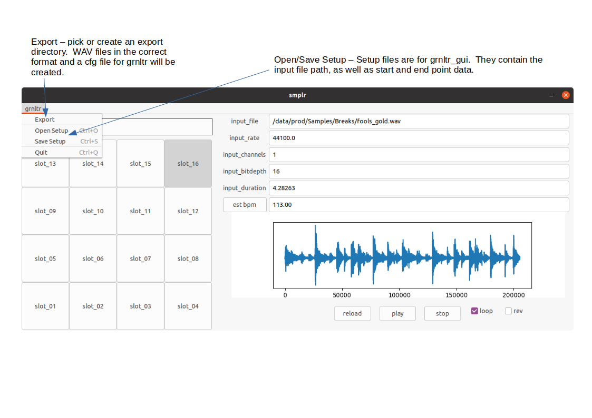

# grnltr_gui
A python3 based sample management GUI for [grnltr](https://github.com/jazamatronic/grnltr)

# Installation

After cloning the repository there are two methods for installing the recquired python packages.  
If site wide packages are already available for wxPython some disk space can be saved by using them instead of downloading them locally.  
In this case, `install_use_site_packages.sh` should be used.  
To install all dependancies, use `install.sh`.  This requires around 820M of disk space, which seems excessive.

# Usage

Launch the gnrltr_gui with `./run.sh`  

  
  
